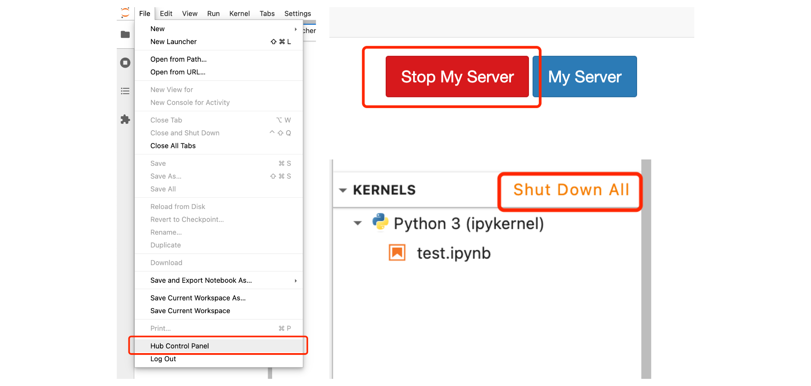

# JupyterHub Deployment Resources

本仓库包含用于部署 JupyterHub 所需的资源文件。

> **在下文中，"jupyter-ip" 指的是 JupyterHub 服务器的实际 IP 地址。"Jupyter Server" 和"容器"的含义大致等同**

## 使用指南

### 注册

首先，您需要注册一个 JupyterHub 账户。请访问 `http://jupyter-ip:8080`，并使用您的用户名和密码注册。请注意，您的用户名和密码将用于登录 JupyterHub 和 SSH 访问。

### 介绍

我们使用 JupyterHub + DockerSpawner 的方式为每个用户提供 Jupyter Notebook 服务。每个用户的 Jupyter Notebook 服务都在一个独立的 Docker 容器中运行。这种设置的优点是您可以获得一个干净的环境，不受其他用户的影响。

每个用户的初始镜像是一个自定义构建的 jupyter-notebook 镜像，基于 mambaorg/micromamba 镜像，其中包含 Jupyter Notebook 运行环境。您可以在 nbimage 目录中找到其 Dockerfile。

请注意，每次登录 Jupyter Notebook 时都会启动一个新的容器。我们已将每个用户的工作目录挂载到了 Docker Volume 中，因此您的工作目录不会丢失。但是根目录下的文件会丢失，因此请避免在根目录下存储重要文件。

> **我们没有为每个用户设置容器自动销毁的时间限制，因此您可以在容器中长时间运行程序。只要您不手动关闭 Jupyter Server，您的容器就会持续运行。您也可以自由安装所需的软件，但请注意，在容器销毁后，您的安装将丢失。**

### SSH 访问

如果您想要通过 SSH 在 IDE/VS Code 中连接到服务器，这也是完全可行的。但是，由于每个容器都与外界隔离，我们专门设置了一个 SSH 网关用于此目的。您可以通过 SSH 网关连接到您的容器，该网关监听端口为 `2222`。例如，如果您的用户名是 "bob"，您可以使用以下命令连接到您的容器：

```bash
ssh bob@jupyter-ip -p 2222
```

> 请注意，此处的用户名是您的 JupyterHub 注册用户名，而不是您的 Linux 用户名。您输入的密码也是您的 JupyterHub 密码，而不是 Linux 密码。
> Linux 用户名每个用户都是 "mambauser"，密码也是 "mambauser"。

## `jupyter-notebook` 镜像概述

默认镜像已预先安装了 Python 3.10 和 CUDA 环境，以及常见的 Python 包，如 pytorch。您可以在 `nbimage/Dockerfile` 中查看安装的软件包的具体列表。

- 操作系统：Debian 12 bookworm
- Conda 软件包:
  - python=3.10
  - pytorch-gpu
  - gnuradio
  - beautifulsoup4
  - cython
  - ipympl
  - ipywidgets
  - matplotlib
  - numba
  - pandas
  - scikit-image
  - scikit-learn
  - scipy
  - seaborn
  - sympy
  - jupyterhub=4.0.2
  - notebook
- APT 软件包:
  - tmux
  - nvtop
  - cmake
  - build-essential
  - openssh-server
  - systemd
  - htop
  - vim
  - curl
  - wget
  - zip
  - unzip
  - sudo

> 如果您需要更多软件包，可以修改 `nbimage/Dockerfile` 并重新构建镜像。欢迎提交拉取请求，我们将考虑将您的更改合并到主分支。

## Q&A

### 如何在容器中安装软件包？

您可以使用 micromamba/pip/apt install 命令在容器中安装所需的软件包。但请注意，容器销毁后，您安装的软件包将会丢失，因此需要在每次登录容器时重新安装它们。

要使用 micromamba 命令，您需要先激活 conda 环境。您可以在容器中按照以下步骤配置 shell：

```bash
# 容器启动后只需要执行一次
micromamba shell init
# 激活 base 环境
micromamba activate base
# 安装软件包
micromamba install -y <package>
```

### 为什么是 micromamba？

选择使用 micromamba 是因为它是一个轻量级的 Conda 包管理工具，特别适用于容器化环境。它具有快速的启动时间和小的存储占用，并且拥有更快的依赖解析速度和多线程下载能力。

### 容器中是否可以运行 GPU 加速的任务？

是的，容器中可以运行 GPU 加速的任务。我们已经安装好了 Nvidia 驱动和 CUDA 环境，您可以在容器中运行 GPU 加速的任务。

### 如何查看容器的资源使用情况？

我们已经安装了 htop 和 nvtop 工具，而且没有对用户的资源施加限制。为了有效地节省服务器资源，建议定期在 JupyterHub 中关闭不再需要的 Jupyter Notebook 进程。



### 如何运行长时间的任务？

1. 使用SSH或者网页登录到您的容器。

2. 运行以下命令以启动一个新的 `tmux` 会话：

   ```bash
   tmux
   ```

   这将创建一个新的 `tmux` 会话，您可以在其中运行长时间任务。

3. 在 `tmux` 会话中运行您的任务，例如：

   ```bash
   python your_long_running_script.py
   ```

4. 然后，您可以按下 `Ctrl-B`，然后松开，接着按下 `D` 来分离 `tmux` 会话。这样，您可以在不中断任务的情况下关闭终端。

5. 如果需要重新连接到 `tmux` 会话，可以运行以下命令：

   ```bash
   tmux attach-session -t 0
   ```

   这将重新连接到之前创建的 `tmux` 会话，您可以继续监视和管理长时间任务。

> **请务必注意，运行长时间任务时，请不要意外关闭 Jupyter Server，因为这会导致容器被释放，从而中断您的任务。**
